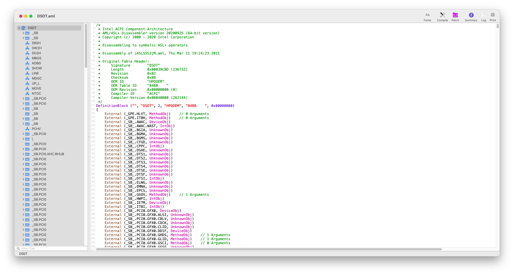
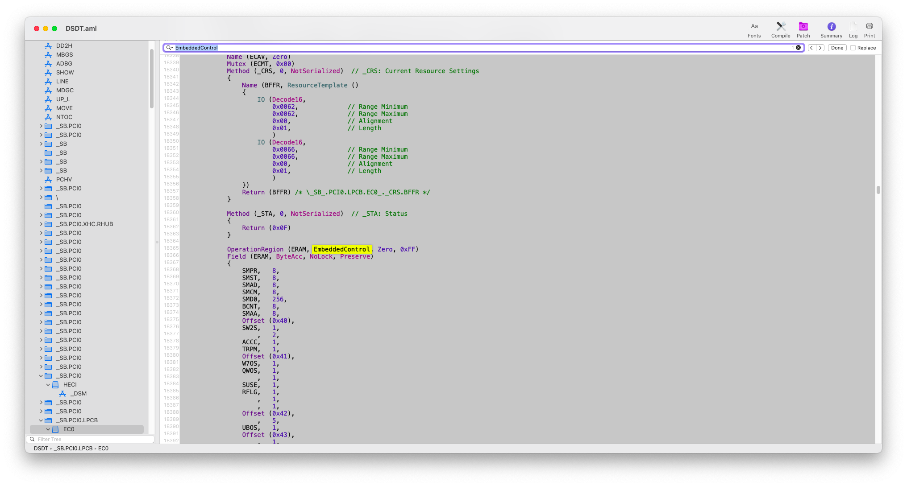
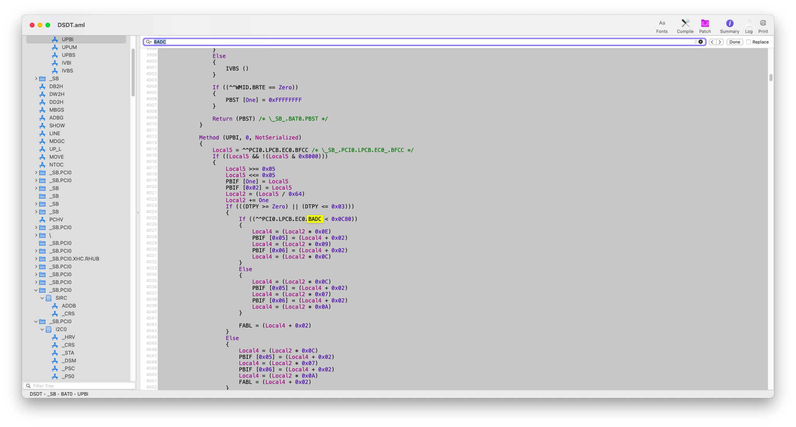
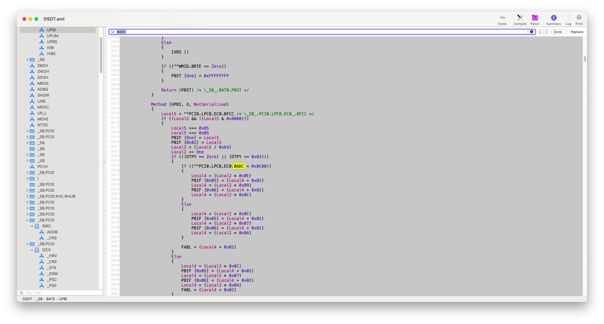
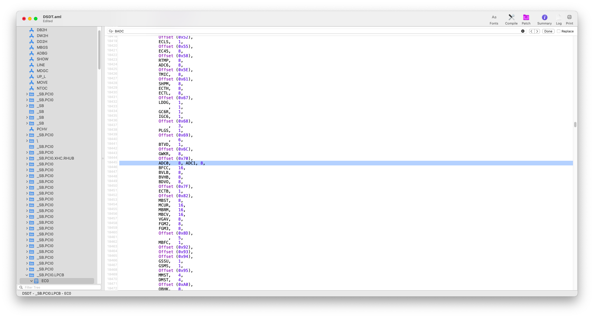
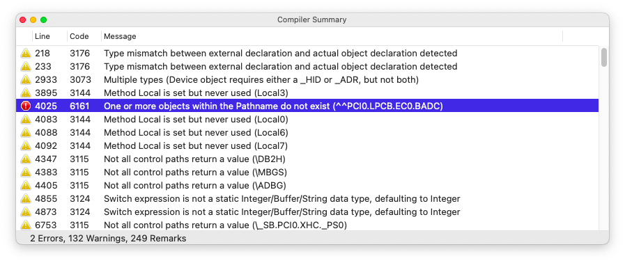
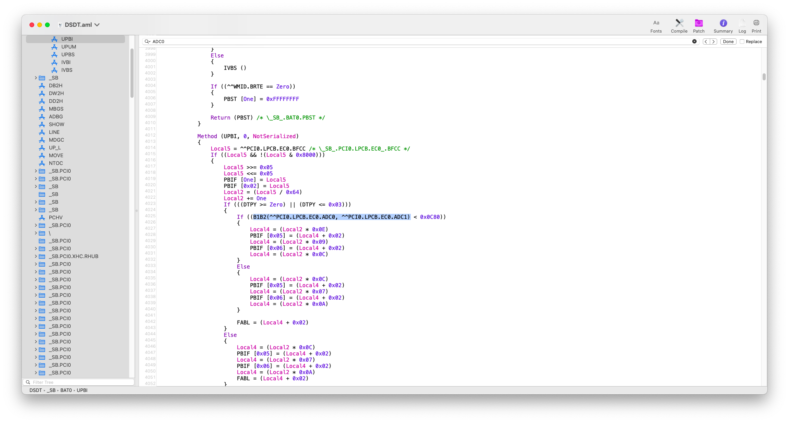

# How to correctly patch battery status on macOS

Before deep going inside ACPI patching techniques for achieving working battery status, I'd like to give a brief introduction:

> Because the battery hardware in PCs is not compatible with Apple SMbus hardware, we use ACPI to access battery state when running OS X on laptops.</br>
> Generally the use of [ACPIBatteryManager.kext](https://github.com/RehabMan/OS-X-ACPI-Battery-Driver) may help reading the battery status.</br>
> Sadly, later releases of `AppleACPIPlatform` are unable to correctly access fields within the EC (embedded controller). This causes problems for ACPIBatteryManager as the various ACPI methods for battery fail (`_BIF`, `_STA`, `_BST`, etc).</br>
> Despite it's possible to use an older version of AppleACPIPlatform, it's safer and more vanilla using the latest version bundled with the operating system and adapt your DSDT to be comply with the limitations of AppleACPIPlatform.</br>
> More specifically, any fields in the EC larger than 8-bit, must be changed to be accessed 8-bits at one time. This includes 16, 32, 64, and larger fields.

This section has been gently taken from [RehabMan's thread on tonymacx86](https://www.tonymacx86.com/threads/guide-how-to-patch-dsdt-for-working-battery-status.116102/).

Please note that, despite the guide explicitly talks about Clover, the patching criteria is the same as on OpenCore, even with the hot-patching technique, which we'll cover in another guide. 

//TODO: Add link to the hot-patching guide

## How to start then?

The requirements are just a few:

- A copy of your DSDT extracted using OpenCore's SysReport feature
- [MaciASL](https://github.com/acidanthera/maciasl/releases/latest)
- [Hex Fiend](https://hexfiend.com)
- Lot and lot of patience. No need to hurry, as you may make mistakes

Let's go (pray for at least 5 times a day and hope that everything goes well haha).

Let's start by opening with MaciASL your `DSDT.aml`:



Then, press `⌘+F` and search `EmbeddedControl`



If you don't get any result, then your battery status isn't handled by `EmbeddedControl` and I don't have any idea on how to do it :/

//BUG: e.g. Surfaces laptops use _SAN method for handling the battery status reporting and it's not easy to patch it :/

//TODO: Please note that this is just an example, so feel free to change the content as you want, by highlighting the Operation Region

Else, if you found a result, like I did, write down `OperationRegion` line and the `Field` line one.

In our case:

```
            OperationRegion (ERAM, EmbeddedControl, Zero, 0xFF)
            Field (ERAM, ByteAcc, NoLock, Preserve)
```
It's really important to take note of the field name as the patching fields depends in fact on `Field (ERAM)` (or whatever it's called). We'll need it later.

Then let's proceed by reading the EC fields contained inside `Field (ERAM)`:

<details><summary>EC Fields</summary>
<pre>
{
                SMPR,   8, 
                SMST,   8, 
                SMAD,   8, 
                SMCM,   8, 
                SMD0,   256, 
                BCNT,   8, 
                SMAA,   8, 
                Offset (0x40), 
                SW2S,   1, 
                    ,   2, 
                ACCC,   1, 
                TRPM,   1, 
                Offset (0x41), 
                W7OS,   1, 
                QWOS,   1, 
                    ,   1, 
                SUSE,   1, 
                RFLG,   1, 
                    ,   1, 
                    ,   1, 
                Offset (0x42), 
                    ,   5, 
                UBOS,   1, 
                Offset (0x43), 
                    ,   1, 
                    ,   1, 
                ACPS,   1, 
                ACKY,   1, 
                GFXT,   1, 
                    ,   1, 
                    ,   1, 
                Offset (0x44), 
                    ,   7, 
                DSMB,   1, 
                GMSE,   1, 
                    ,   1, 
                QUAD,   1, 
                Offset (0x46), 
                Offset (0x47), 
                ADC4,   8, 
                ADC5,   8, 
                Offset (0x4C), 
                STRM,   8, 
                Offset (0x4E), 
                LIDE,   1, 
                Offset (0x50), 
                    ,   5, 
                DPTL,   1, 
                    ,   1, 
                DPTE,   1, 
                Offset (0x52), 
                ECLS,   1, 
                Offset (0x55), 
                EC45,   8, 
                Offset (0x58), 
                RTMP,   8, 
                ADC6,   8, 
                Offset (0x5E), 
                TMIC,   8, 
                Offset (0x61), 
                SHPM,   8, 
                ECTH,   8, 
                ECTL,   8, 
                Offset (0x67), 
                LDDG,   1, 
                    ,   1, 
                GC6R,   1, 
                IGC6,   1, 
                Offset (0x68), 
                    ,   3, 
                PLGS,   1, 
                Offset (0x69), 
                    ,   6, 
                BTVD,   1, 
                Offset (0x6C), 
                GWKR,   8, 
                Offset (0x70), 
                BADC,   16, 
                BFCC,   16, 
                BVLB,   8, 
                BVHB,   8, 
                BDVO,   8, 
                Offset (0x7F), 
                ECTB,   1, 
                Offset (0x82), 
                MBST,   8, 
                MCUR,   16, 
                MBRM,   16, 
                MBCV,   16, 
                VGAV,   8, 
                FGM2,   8, 
                FGM3,   8, 
                Offset (0x8D), 
                    ,   5, 
                MBFC,   1, 
                Offset (0x92), 
                Offset (0x93), 
                Offset (0x94), 
                GSSU,   1, 
                GSMS,   1, 
                Offset (0x95), 
                MMST,   4, 
                DMST,   4, 
                Offset (0xA0), 
                QBHK,   8, 
                Offset (0xA2), 
                QBBB,   8, 
                Offset (0xA4), 
                MBTS,   1, 
                MBTF,   1, 
                    ,   4, 
                AD47,   1, 
                BACR,   1, 
                MBTC,   1, 
                    ,   2, 
                MBNH,   1, 
                Offset (0xA6), 
                MBDC,   8, 
                Offset (0xA8), 
                EWDT,   1, 
                CWDT,   1, 
                LWDT,   1, 
                AWDT,   1, 
                Offset (0xAA), 
                    ,   1, 
                SMSZ,   1, 
                    ,   5, 
                RCDS,   1, 
                Offset (0xAD), 
                SADP,   8, 
                Offset (0xB2), 
                RPM1,   8, 
                RPM2,   8, 
                Offset (0xB7), 
                Offset (0xB8), 
                Offset (0xBA), 
                Offset (0xBB), 
                Offset (0xBC), 
                Offset (0xC1), 
                DPPC,   8, 
                Offset (0xC8), 
                    ,   1, 
                CVTS,   1, 
                Offset (0xC9), 
                TPVN,   8, 
                Offset (0xCE), 
                NVDX,   8, 
                ECDX,   8, 
                EBPL,   1, 
                Offset (0xD2), 
                    ,   7, 
                DLYE,   1, 
                Offset (0xD4), 
                PSHD,   8, 
                PSLD,   8, 
                DBPL,   8, 
                STSP,   8, 
                Offset (0xDA), 
                PSIN,   8, 
                PSKB,   1, 
                PSTP,   1, 
                    ,   1, 
                PWOL,   1, 
                RTCE,   1, 
                Offset (0xE0), 
                DLYT,   8, 
                DLY2,   8, 
                Offset (0xE5), 
                GP12,   8, 
                SFHK,   8, 
                Offset (0xE9), 
                DTMT,   8, 
                PL12,   8, 
                ETMT,   8, 
                Offset (0xF2), 
                ZPOD,   1, 
                    ,   4, 
                WLPW,   1, 
                WLPS,   1, 
                ENPA,   1, 
                Offset (0xF4), 
                SFAN,   8, 
                Offset (0xF8), 
                BAAE,   1, 
                S3WA,   1, 
                BNAC,   1, 
                    ,   1, 
                EFS3,   1, 
                S3WK,   1, 
                RSAL,   1
            }
</pre>
</details>

As you can see, this list is really long so we're gonna strip it a little bit with the following criteria:

- count the fields whose size is greater than 8
- exclude (just for the moment) `Offset` keyword lines

After stripping you should have a result like the spoiler below:

<details><summary>Stripped EC fields</summary>
<pre>
{
                SMD0,   256, 
                BADC,   16, 
                BFCC,   16, 
                MCUR,   16, 
                MBRM,   16, 
                MBCV,   16, 
}

</pre>
</details>

As you can see there are only 5 16bits fields and only one 256 bit variable.
The next step is to examine the items in the `Field` definition, looking for items which are larger than 8-bit.

Let's search `Field (ERAM)` (or whatever is called the previously identified field) and again take note of the fields which are larger than 8-bit:

<details><summary>New found fields</summary>
<pre>

            Field (ERAM, ByteAcc, NoLock, Preserve)
            {
                Offset (0x04), 
                SMW0,   16
            }

            Field (ERAM, ByteAcc, NoLock, Preserve)
            {
                Offset (0x04), 
                FLD0,   64
            }

            Field (ERAM, ByteAcc, NoLock, Preserve)
            {
                Offset (0x04), 
                FLD1,   128
            }

            Field (ERAM, ByteAcc, NoLock, Preserve)
            {
                Offset (0x04), 
                FLD2,   192
            }

            Field (ERAM, ByteAcc, NoLock, Preserve)
            {
                Offset (0x04), 
                FLD3,   256
            }
</pre>
</details></br>
Now after taking note of the fields let's search them manually on MaciASL and if we find a reference, we need to write down and patch it.

//BUG: Please note that SMD0 variable mustn't be considered as generally it's found on I2C devices and can break its functionality on macOS and possibly on other OSs.



Below a list of found references
<details><summary>Found references</summary>
<pre>

                BADC,   16, 
                BFCC,   16, 
                MCUR,   16, 
                MBRM,   16, 
                MBCV,   16, 
                SMW0,   16,
                FLD0,   64,
                FLD1,   128,
                FLD2,   192,
                FLD3,   256

</pre>
</details>
</br>

As RehabMan says in the patching guide:

> When fields larger than 32-bit are accessed, they are accessed as type Buffer.</br>
> Fields 32-bit or under are accessed as Integers.</br>
> This is important to realize as you change the code.<br>
> Buffers are a bit more work to change.<br>
> Also, realize this code is "reading" from the EC.<br>
> Reads and writes must be handled differently.


Again please note that this list is strictly linked to the laptop model and BIOS version we used. Don't blind-patch ++

So let's start by first patching 16-bits fields.

## 16-bits field patching

Let's take for example `BADC` field which has 1 reference in the DSDT (we're not going to count the comments >_>):



For each 16-bits field we should use a utility method called `B1B2` which can do the work for us:

open MaciASL patch menu, copy and paste this patch and click on apply

```
into method label B1B2 remove_entry;
into definitionblock code_regex . insert
begin
Method (B1B2, 2, NotSerialized) { Return(Or(Arg0, ShiftLeft(Arg1, 8))) }\n
end;
```

Basically, what this method does is taking two arguments (low-byte, high-byte), and returns a 16-bit value from the two 8-bit values.

In other words: imagine you have a cracker (food biscuit) and split it onto two equal parts. If you reattach them it's still a cracker. Simple, nah?

Anyways, after this ridiculous explanation, let's rename the original `BADC` field onto two 8-bit fields.</br>
Please note that the two fields MUST have different names.</br>
In this case we'll use this convention for `BADC` field:

- remove the first letter (`B`) and add a `0` for the low-byte field, and a `1` for the high-byte field.

So we'll have splitted the original `BADC` field onto two 8-bit fields called `ADC0` and `ADC1`.

See the below image for reference:



After doing this, click on `Compile` button of MaciASL and, since we found a reference to the field, and look for the errors.

Here we found an error:



Click on it and look for the field call:


Let's change it as it follows:

since `BADC` doesn't exist more, we're going to call `B1B2` method as it follows:



It's important that you respect the previous field call: 

//TODO: improve the explanation of the call

Before it was called with `^^PCI0.LPCB.EC0.BADC`, but now, since we splitted it onto two 8-bit fields, we call it via `B1B2(^^PCI0.LPCB.EC0.ADC0, ^^PCI0.LPCB.EC0.ADC1)`.

Iterate this process for each 16-bit fields.

Please note that variable naming has strict rules which you can consult here

//TODO: give variable naming rules by looking on ACPICA 6.3


## 32-bit fields patching

As well as we did for 16-bit fields which we splitted onto 2 8-bit fields, we're going to split 32-bit onto 4 8-bit fields.

This time instead, we're going to use another utility method called `B1B4`:

open MaciASL patch menu, copy and paste this patch and click on apply

```
into method label B1B4 remove_entry;
into definitionblock code_regex . insert
begin
Method (B1B4, 4, NotSerialized)\n
{\n
    Store(Arg3, Local0)\n
    Or(Arg2, ShiftLeft(Local0, 8), Local0)\n
    Or(Arg1, ShiftLeft(Local0, 8), Local0)\n
    Or(Arg0, ShiftLeft(Local0, 8), Local0)\n
    Return(Local0)\n
}\n
end;
```

## Credits

* **Apple** for macOS
* **Acidanthera** for MaciASL
* **RehabMan** for DSDT patching guide
* **ridiculous_fish** for Hex Fiend
* **every other people that contributed to the hackintosh world :haha:**


